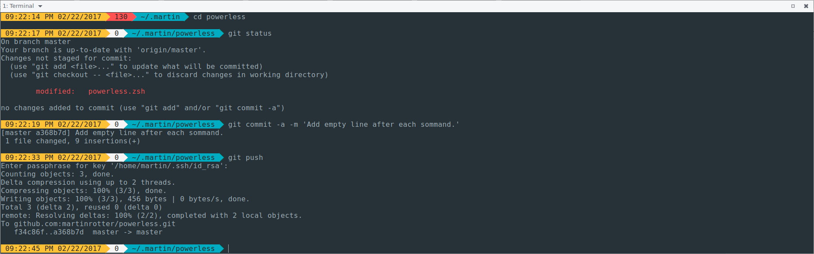

# powerless
Tiny &amp; simple pure ZSH prompt inspired by powerline.

## What is this stuff?
This is fast and tiny set of ZSH scripts providing some nice ZSH setup, including powerline-inspired prompt and some other enhancements. The prompt offers some nice visual experience and information, including Git (coming soon) repositories metadata.

## Installation.
1. Make sure that you have some powerline-enabled font installed and activated in your terminal emulator.
2. Clone this repo into standalone folder: `git clone https://github.com/martinrotter/powerless.git powerless`.
3. Source main powerless script in your `.zshrc`: `source "/path/to/file/powerless.zsh"`.
4. (optional) In your `.zshrc`, call function `make-me-powerless`. That will enable some advanced ZSH goodies like completion, aliases etc.
5. Make sure that your `.zshrc` does not contain any code which might conflict with powerless scripts.